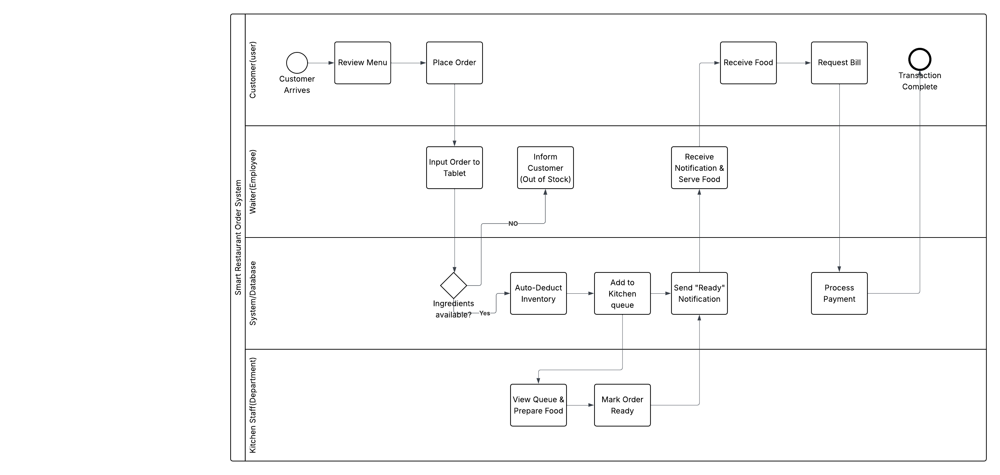
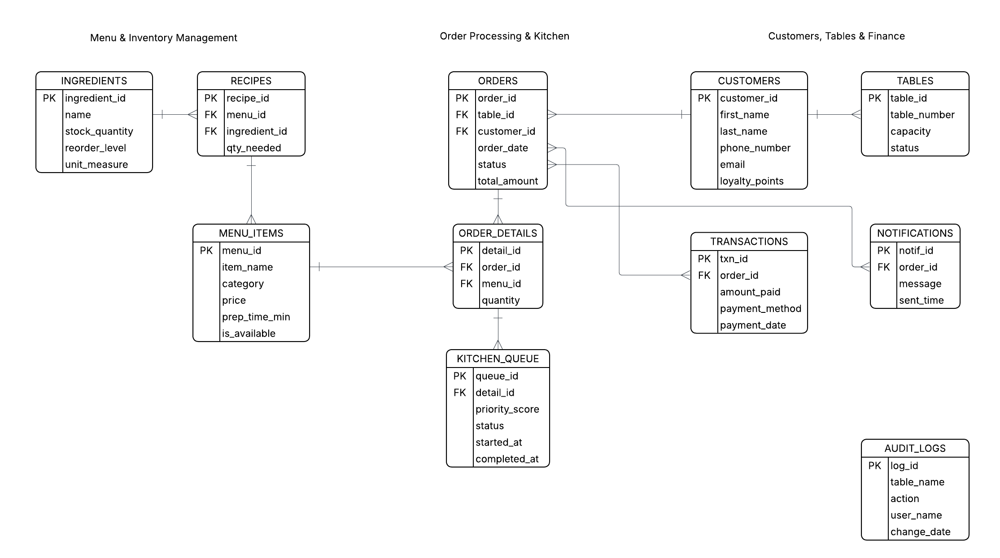
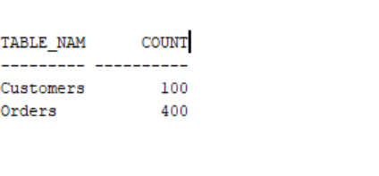
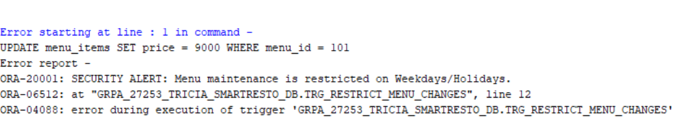
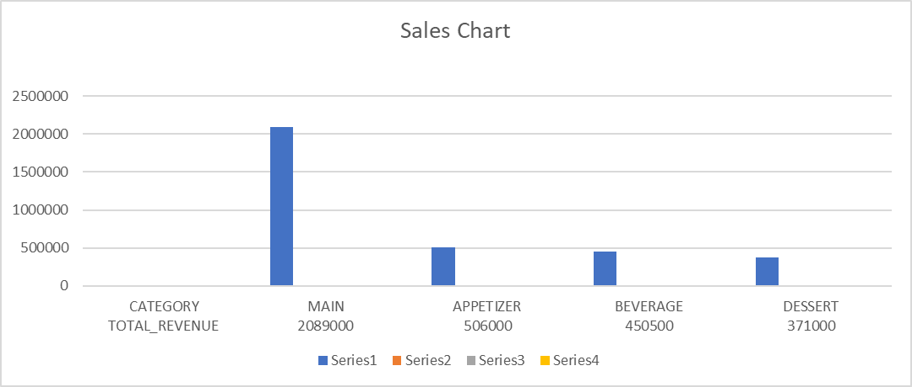
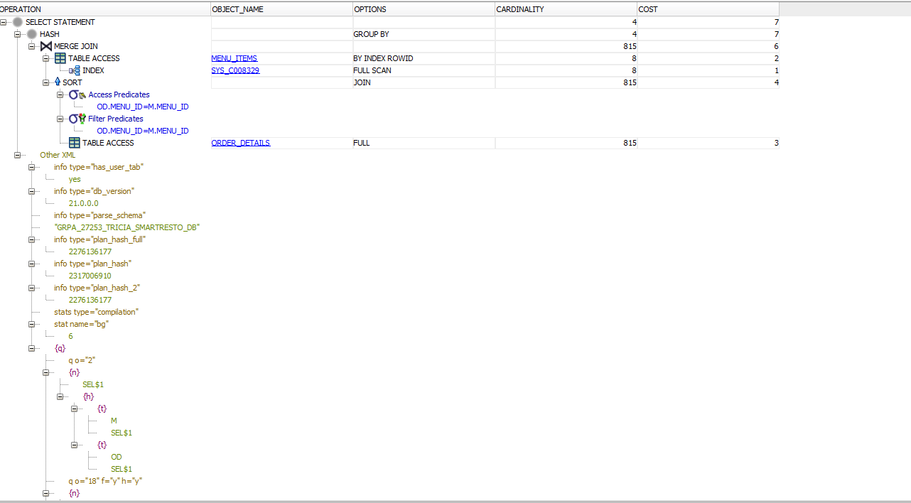
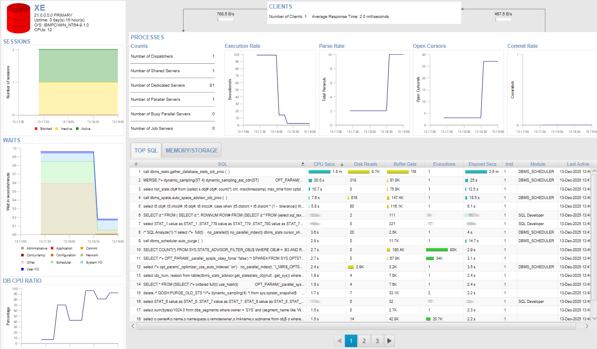

# Smart Restaurant Management System
**Oracle Database PL/SQL Capstone Project**

---

### **Student Information**
* **Name:** Tricia Nshuti
* **Student ID:** 27253
* **Institution:** Adventist University of Central Africa (AUCA)
* **Course:** Database Development with PL/SQL (INSY 8311)
* **Lecturer:** Eric Maniraguha
* **Submission Date:** December 2025

---

## 🗺️ Project Navigation (Phases I - VIII)

This repository is organized according to the 8-Phase Capstone Project structure. Below is the documentation, code, and evidence for each phase of development.

---

### **PHASE I: Problem Identification**
**Objective:** Identify a real-world problem and define the scope.
* **Problem:** Inefficient manual ticketing systems in restaurants lead to slow service, inventory wastage, and security risks during billing.
* **Solution:** A centralized Oracle Database system to automate order processing, enforce security on menu pricing, and track inventory in real-time.
* **Key Deliverable:** [Project Overview & Objectives](documentation/Smart_Restaurant_Order___Kitchen_Management_System.pdf)

---

### **PHASE II: Business Process Modeling**
**Objective:** Model the business flow and system architecture.
* **Explanation:** The system follows a Client-Server architecture. The Business Process Model (BPMN) illustrates the flow from "Customer Seated" to "Kitchen Notification" and "Payment."
* **📄 Documentation:**
    * [View Business Process Model (BPMN PDF)](documentation/GrpA_27253_Tricia_SmartResto_Process.pdf.pdf)
    * [View System Architecture](documentation/architecture.md)
    * **🖼️ Evidence (BPMN Diagram):**
    
---

### **PHASE III: Logical Database Design**
**Objective:** Design a normalized Entity-Relationship (ER) model.
* **Explanation:** The database uses a 3NF schema. The Logical Data Model details all entities (Customers, Orders, Menu, Ingredients), relationships, and cardinality constraints.
* **📄 Documentation:**
    * [View Logical Data Model Report (PDF)](database/documentation/27253_Tricia_SmartResto_DataModel.pdf)
    * [View Data Dictionary](documentation/data_dictionary.md)
* **🖼️ Evidence (ER Diagram):**

---

### **PHASE IV: Database Creation**
**Objective:** Configure the Oracle PDB and Environment.
* **Explanation:** Database users, tablespaces, and administrative configurations were set up to support high-volume transaction data.
* **📂 Files:** [View Admin Scripts](database/scripts/)

---

### **PHASE V: Table Implementation & Data**
**Objective:** Create physical tables and populate with realistic data.
* **Explanation:** 11 Tables were created with constraints (PK, FK, Check). A PL/SQL loop generated **500+ realistic rows** to simulate actual restaurant usage.
* **📂 Code:** [Create Tables](database/scripts/03_Create_Tables.sql) | [Insert Data Script](database/scripts/04_Insert_Data.sql)
* **🖼️ Evidence (500+ Rows Generated):**

---

### **PHASE VI: PL/SQL Development**
**Objective:** Develop Procedures, Functions, and Packages.
* **Explanation:** All core logic is encapsulated in the `PKG_RESTAURANT_OPS` package.
    * `sp_place_order`: Handles transaction logic (Inventory check, Order creation).
    * `fn_calculate_wait_time`: Real-time calculation function.
* **📂 Code:** [Package Specification](database/scripts/06_Package_Spec.sql) | [Package Body](database/scripts/07_Package_Body.sql)

---

### **PHASE VII: Advanced Programming & Security**
**Objective:** Implement Triggers, Auditing, and Restriction Rules.
* **CRITICAL RULE:** Administrative changes (Menu Updates) are **BLOCKED** on Weekdays (Mon-Fri).
* **Auditing:** All attempts (blocked or allowed) are logged via an **Autonomous Trigger**.
* **📂 Code:** [Restriction Trigger](database/scripts/11_Restriction_Trigger.sql) | [Audit Trigger](database/scripts/12_Audit_Trigger.sql)

**🖼️ Evidence 1: System Blocking a Weekday Change**
*(The system correctly throws Error ORA-20001)*

**🖼️ Evidence 2: Audit Log Capturing the Breach**
*(The security camera recorded the "BLOCKED" action despite the rollback)*

---

### **PHASE VIII: BI & Analytics**
**Objective:** Dashboards, KPIs, and Performance Tuning.
* **Explanation:** Complex queries analyze revenue trends and inventory health. Performance is optimized using indexes on `customer_id` and `order_date`.
* **📂 Code:** [BI Reporting Queries](queries/bi_reporting_queries.sql)
* **📄 Full Report:** [View BI Dashboard Mockups (PDF)](business_intelligence/dashboards.pdf)

**🖼️ Evidence 1: Financial Performance (Revenue by Category)**
*(Generated from Phase VIII Analytics)*

**🖼️ Evidence 2: Performance Tuning (Explain Plan)**
*(Proves use of Index Scans for optimization)*

**🖼️ Evidence 3: System Monitoring (OEM Dashboard)**
*(Real-time CPU & Memory monitoring)*

---

### **Declaration**
I confirm that this work is original and complies with the academic integrity policy of AUCA. All code, documentation, and testing results were generated individually for this Capstone Project.
